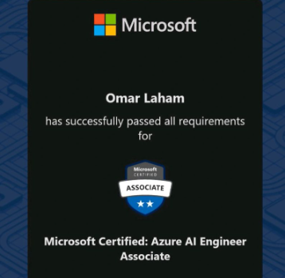
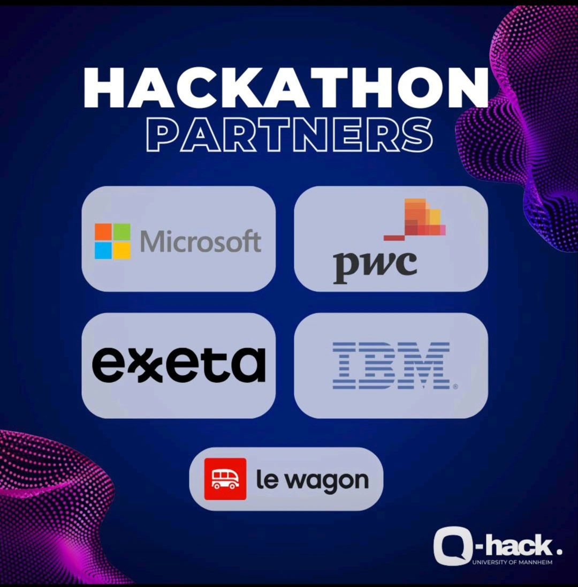
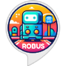
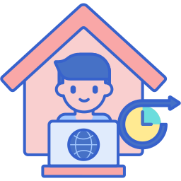

# AI-Portfolio
My AI Portfolio

# Certificates & Degrees
## Microsoft Certified: Azure AI Engineer Associate

    

* Issued by **Microsoft** on August 7, 2024
* Online Verification: Kindly [click here](https://learn.microsoft.com/en-us/users/omarlaham-5718/credentials/b2c859d73c2256f8?ref=https%3A%2F%2Fwww.linkedin.com%2F)

### Skills:

## AI for Health Care - Udacity Nanodegree
Build, evaluate, and integrate predictive models that have the power to transform patient outcomes.

* Issued by **Udacity** on January 2022
* Online Verification: Kindly [click here](https://www.udacity.com/certificate/KUP26G3J)

### Skills:

### Sub-projects:
* AI in **2D Medical Imaging Classification** (Pneumonia Detection). [Github repo](https://github.com/OmarLaham/udacity-healthcare-ai-2d-imaging-pneumonia).
* AI in **3D Medical Imaging Segmentation** (Hippocampus Quantification for Early Alzheimer's Prediction). [Github repo](https://github.com/OmarLaham/udacity-healthcare-ai-3d-imaging-alzheimer).
* AI in **EHR Data** (Patient Selection for Trials). [Github repo](https://github.com/OmarLaham/udacity-healthcare-ai-ehr).
* AI in **Wearable Device** Data (Pulse Rate Estimation Correction) & Signal Processing. [Github repo](https://github.com/OmarLaham/udacity-healthcare-ai-wearable).

# Hacathons

## Q-Summit 2024 , Hackathon, Mannheim Germany - Winner Team (1st Place)
Happy to be a member of the **winner team** (1st place) at the hackathon of **Q-Summit 2024, Germany’s most important conference for entrepreneurship and innovation!** ✌️🥳🥳
 
We had 2 days full of fun, creativity and networking with great leaders, brilliant minds and very nice participants.
 
**Project:** GenAI (Generative Artificial Intelligece)-Based Study Assistant App using OpenAI API, Azure Cloud & Streamlit.
 

	

  

### Repo & Demo Video:
[Github Repo](https://github.com/OmarLaham/QSummit-2024-Hackathon-Caupona/tree/main)

## AI 4 Life Sciences - 2nd Edition - Current -
"AI for Life Sciences is a recurring challenge series aimed at connecting AI enthusiasts and practitioners with organizations who would like to explore how to apply AI to use cases and domains across the broad domain of life sciences. Possible research domains including biology, genetics, ecology, microbiology, physiology, cell biology, botany – and more – fields which comprise the diverse branches of science commonly referred to as life sciences." ([AI4LS Homepage](https://ai4lifesciences.com/about/))

* Project: Using AI **Timeseries Forecast** to **Predict Ground Water Levels** for ~450 Geographical Points in Austria between **2022 and 2024**.
* Partners (2024):

	

Github Repo: Available upon final submission..

# Projects

## Robus:

    

An **AI for IoT** project implemented as an **Alexa Smart Skill** on top of **Azure Cloud**
In addition to keep my skills up-to-date, this project is aimed to be a fun project to create a tool that helps me catch the bus on time and even buy me a ticket online automatically 😉

### Skills:

### Repo & Source Code:
[Github Repo](https://github.com/OmarLaham/Robus)

## RW-Buddy:

    

An AI Agent That Brings Joy Back Into Remote-Workers Life by suggesting a daily plan that contains places to visit for working and having fun.

### Skills:

### Repo & Source Code:
[Github Repo](https://github.com/OmarLaham/RW-Buddy)

### Demo Video:
Kindly [click here](https://youtu.be/fnhrjF15kyQ) for a Youtube video demo ▶️ of the app 😊.

